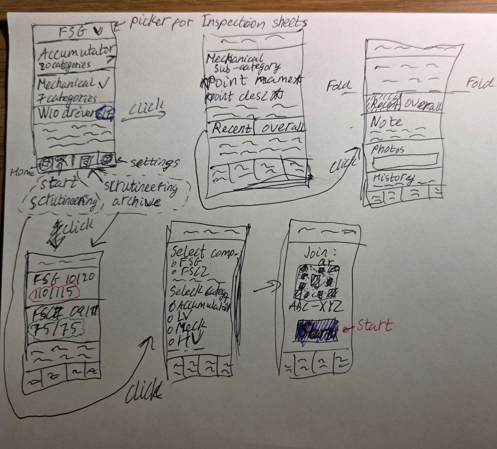

# TDP028

- [App Description](#app-description)
- [Competitive Analysis](./docs/01-competitive_analysis.md)

## App Description

### The main idea
The idea behind the 'PitCheck' app is to assist engineers from different Formula Student teams to manage their technical inspection a.k.a. scrutineering. This is done by providing Inspection Sheets from different competitions like FSG (Formula Student Germany), FSCZ (Czech Republic), FSA (Austria) and more. Each Inspection Sheet contains hundreds of scrutineering points based on hard rules for a specific competition and is divided into several categories, like 'Accumulator', 'Mechanical' and more. This app makes it easier for engineers to navigate through all the scrutineering points and keep track of the progress, and even do mock-scrutineerings to prepare the team for real competition-like scenarios.

### User group
The user group of this app is Formula Student engineers (and other mechanical engineers) that want to prepare their newest car for scrutineering at competitions, or run mock-scrutineerings on their older car(s)

### Main function
The main idea of this app is to gather Inspection Sheets from different competitions and keep track of mock-scrutineerings with detailed data for each point, performance metrics and more. What makes this app so useful is the ability for several people to run mock-scrutineerings with real-time updates, detailed notes and photos for every scrutineering point that might need further refinement. It will also be possible to quickly search, filter and easily access historical information on previous mock-scrutineerings

### Main features

- Inspection Sheets from different competitions with detailed scrutineering points
- A possibility to run mock-scrutineerings with a possibility to approve/reject each scrutineering point and add detailed note and photos. The results are saved for traceability and detailed statistics for each scrutineering point
- A possibility to have several judges run one mock-scrutineering receiving updates from one another in real time. Also several participants should be able to join, and the judges' and participants' names are saved for feature reference
- Detailed statistics and metadata for each scrutineering point from every mock-scrutineering run against it should be visible. It includes things like notes, photos, status change history, judge name, time for decision and aggregated information through several mock-scrutineerings, like pass rate, average time to pass and more.

# Wireframe diagram

