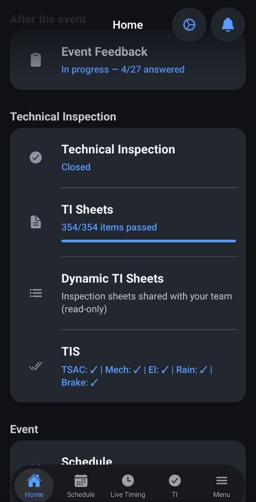
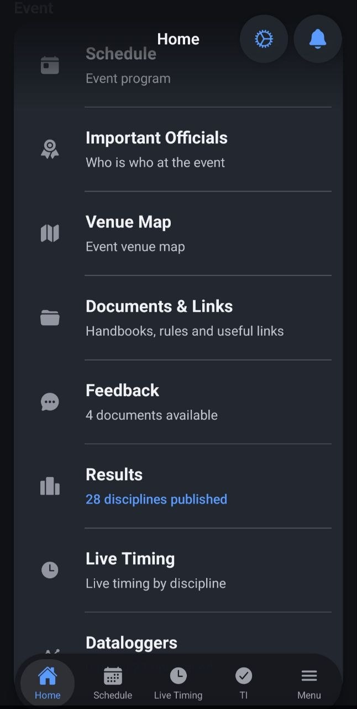
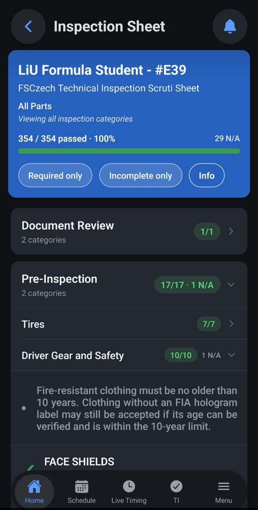
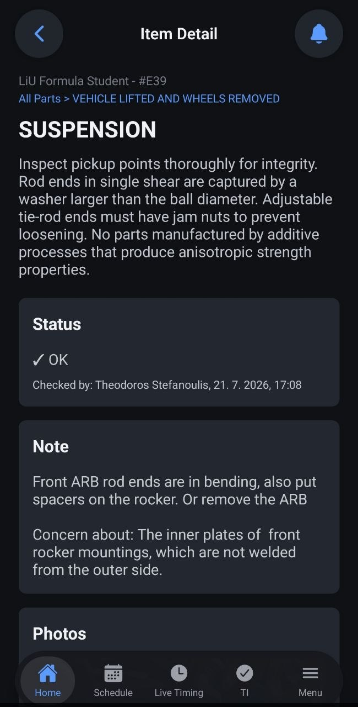

# The competitor

I chose the FSCZ mobile app as an example of a competitor, as it has the basics of scrutineering and Technical Inspection in the app, together with a wider range of features for a smoother competition

- [FSCZ on Google Play](https://play.google.com/store/apps/details?id=com.fsczechmobile&hl=en)
- [FSCZ on the App Store](https://apps.apple.com/us/app/fsczech/id6758867457)

# Requirements

## Must requirements

1. A user (team member) should be able to see their team's cleared Technical Inspection categories to know what part of the car to work on next
2. A user (team member) should be able to see their team's progress status in Technical Inspection in real time to follow their team's progress and prepare fixes
3. A user (team member) should be able to see live timing data with results for every team for each discipline to make result tracking possible and make competition more entertaining
4. A team captain should be able to register their team in a Technical Inspection queue to avoid waiting in a physical queue with their car 
5. An admin should be able to add and edit scrutineering points in an Inspection Sheet to adjust Technical Inspection for changing rules every competition year
6. A scrutineering judge should be able to approve/reject/skip each scrutineering point for a team that is being inspected to make progress tracking possible
7. A scrutineering judge should be able to see live updates and changes for each scrutineering point from other judges to avoid overriding decisions of their colleagues and make a multi-judge setup possible

## Own requirements

8. A user should be able to see live queue status for each scrutineering category to make time planning easier for teams and make it possible to have better time planning by estimating queue time
9. A scrutineering judge should be able to add notes and photos to each scrutineering point to give more context for engineers to fix the rejected points later
10. A user should be able to see penalty points for every team in live status to easily track rule enforcement and the most common mistakes made by other/own teams

# UI screenshots

<table>
  <tr>
    <td align="center">
      <h3>View of the Technical Inspection section</h3>
      
    </td>
    <td align="center">
      <h3>View of the general section</h3>
      
    </td>
  </tr>
  <tr>
    <td align="center">
      <h3>Detailed inspection view</h3>
      
    </td>
    <td align="center">
      <h3>Detailed scrutineering point view</h3>
      
    </td>
  </tr>
</table>
